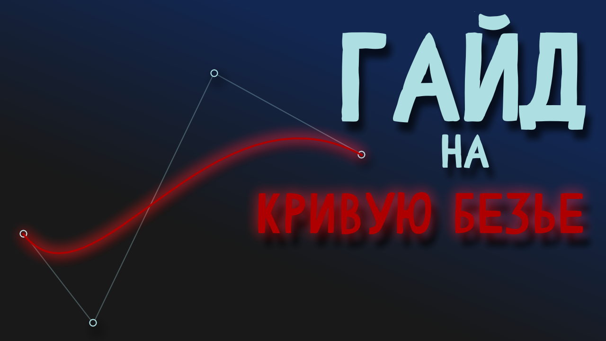
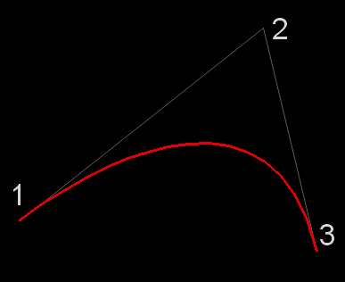
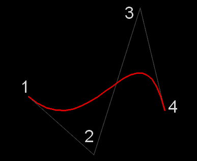
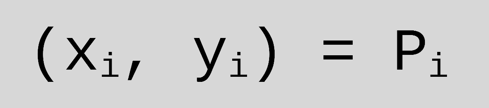
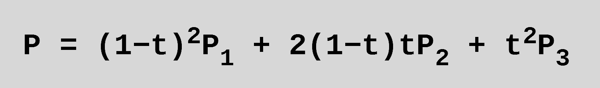
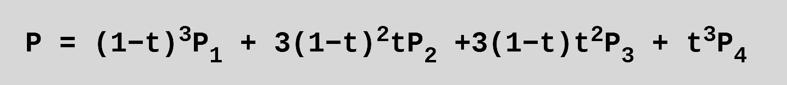
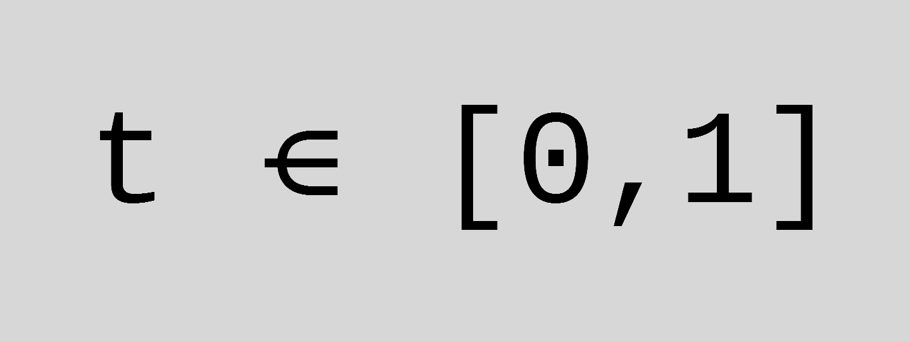
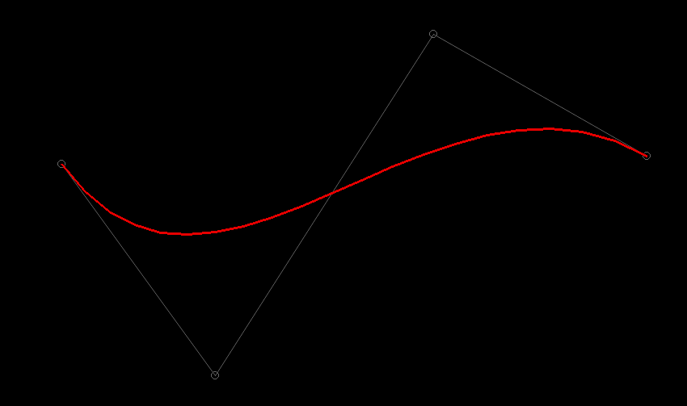

# Гайд на кривую Безье

## Введение
Всем привет!

Сегодня мы изучим кривую, разработанную Пьером Безье. 
Стоит отметить, что параллельно с ним, данную кривую открыл Поль Де Кастельжо. Но её мы рассмотрим в отдельном уроке чуть позже, когда изучим написание графических интерфейсов!

Данные кривые были разработаны для проектирования кузовов автомобилей, а сейчас повсеместно используются в графических редакторах и в веб-разработке. Тот же формат SVG – это документ с точками, по которым составляются кривые.

Напомню, что определённые моменты при разработке я опускаю, тк они были рассмотрены на канале ранее, а также весь код с текстовым описанием урока есть на гитхабе.

Не забудьте подписаться на канал, чтобы ментально поддержать меня на создание новых уроков!
А теперь — перейдём к математике )

## Базовая теория
Кривая задаётся по определённому числу опорных точек. В основном их 3 или 4, то есть кривая квадратичная или кубическая соответственно. 




Для создания сложных фигур зачастую вместо добавления точек — добавляют новые простые кривые. Так изображение проще редактировать в будущем)

Опишем координаты i-той опорной точки по каждой оси буквой P


В таком случае уравнение кривой из трёх точек примет подобный вид:



А вот уравнение уже для кубической кривой:



Переменная t в уравнении изменяется с заданным разработчиком шагом в пределах от нуля до единицы.


Давайте перейдём к написанию кода!

## Практика
Будем реализовывать простой скрипт для кубической кривой, то есть кривой, с четырьмя опорными точками!

Обозначим цвет фона, линий между точками и цвет самой кривой.
Списки для опорных точек, и для координат точек кривой.
А также переменную, которая будет являться своеобразным флагом в нашем коде
```python
BLACK = (0,0,0)
WHITE = (100,100,100)
RED = (230, 0, 0)
dots = []
curve = []
press = 0
```

Сразу же добавляю событие на клавишу R для сброса всех данных, чтобы строить новые кривые без перезапуска программы.
```python
if event.type == pygame.KEYDOWN:
    if event.key == pygame.K_r:
        dots = []
        curve = []
        press = 0
```

Далее при нажатии левой кнопки мыши перебираю значения флага.
```python
if event.type == pygame.MOUSEBUTTONDOWN:
    if event.button == 1:
        if press == 0:
            press = 1
            dots = [event.pos, event.pos, event.pos, event.pos]
        elif press == 1:
            press = 2
        elif press == 2:
            press = 3
        elif press == 3:
            press = -1
```
Если флаг был нулевым — меняю его значение и добавляю 4 точки со значениями позиции нажатия. 

Далее обрабатываю события движения мыши по экрану. В зависимости от значения флага — изменяю соответсвующую точку. Здесь тоже можно написать с использованием стандартных цепочек условий.
```python
if event.type == pygame.MOUSEMOTION:
    if press == 1:
        dots[3] = event.pos
    elif press == 2:
        dots[2] = event.pos
    elif press == 3:
        dots[1] = event.pos
```

Теперь перейдём к отрисовке. Если количество опорных точек больше нуля — рисуем ломанную незамкнутую линию.
```python
if dots:
    pygame.draw.aalines(screen, WHITE, False, dots)
```
Добавим выделение опорных точек с помощью окружностей!
```python
for dot in dots:
    pygame.draw.circle(screen, WHITE, dot, 5, 1)
```
Обнуляем список с точками кривой, чтобы динамически рисовать её каждый кадр.
```python
curve = []
```
Теперь к самому интересному — к формуле)
Чтобы пройтись по дробным значениям t нам не подойдёт стандартный range – используем map в связке с лямбда функцией для генерации списка с дробными значениями и проходим по нему. 
```python
for i in map(lambda x: x/100.0, range(0, 105, 5)):
```

Для значения X и Y используем формулу кубической кривой. 
```python
x = (1.0-i)**3*dots[0][0] + 3*(1.0-i)**2*i*dots[1][0] + 3*(1.0-i)*i**2*dots[2][0] + i**3*dots[3][0]
y = (1.0-i)**3*dots[0][1] + 3*(1.0-i)**2*i*dots[1][1] + 3*(1.0-i)*i**2*dots[2][1] + i**3*dots[3][1]
curve.append([x, y])
```

После прохода по всем значениям t рисуем незамкнутую ломанную линию. Это и будет наша кривая!!
```python
pygame.draw.lines(screen, RED, False, curve, 3)
```

Давайте посмотрим что у нас получилось)

## Итог



Для простого отрезка кривая будет линейна и ничем не примечательна) Для 3 опорных точек мы наблюдаем квадратичную кривую. Добавим четвёртую точку и увидим нашу кубическую кривую!
Можем начать R и обновить опорные точки и поэкспериментировать с различными кривыми!

Очень рад, если данный урок был полезным или натолкнул на новые идеи) Не забывайте подписаться на канал — меня это очень мотивирует работать над новыми видео

Спасибо большое за просмотр !
Не болейте, а если заболели — скорее поправляйтесь. До новых встреч)