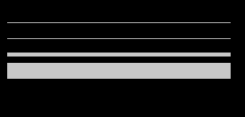
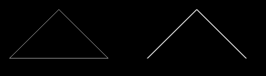
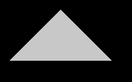
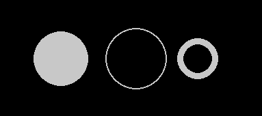
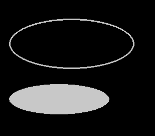
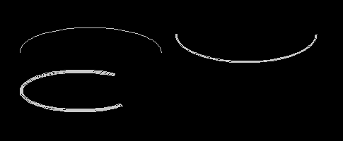
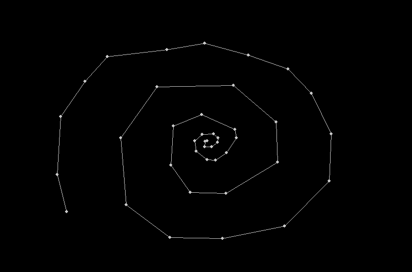
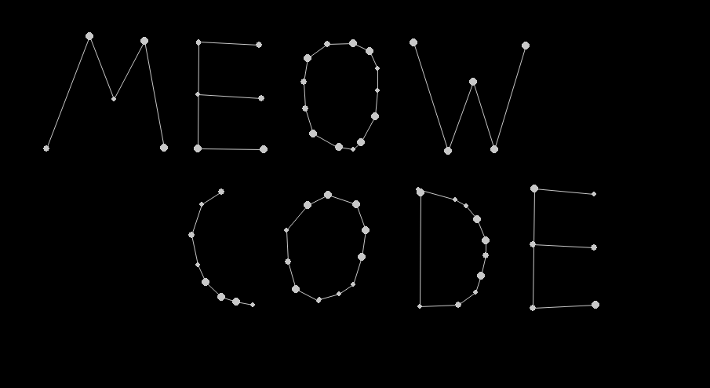
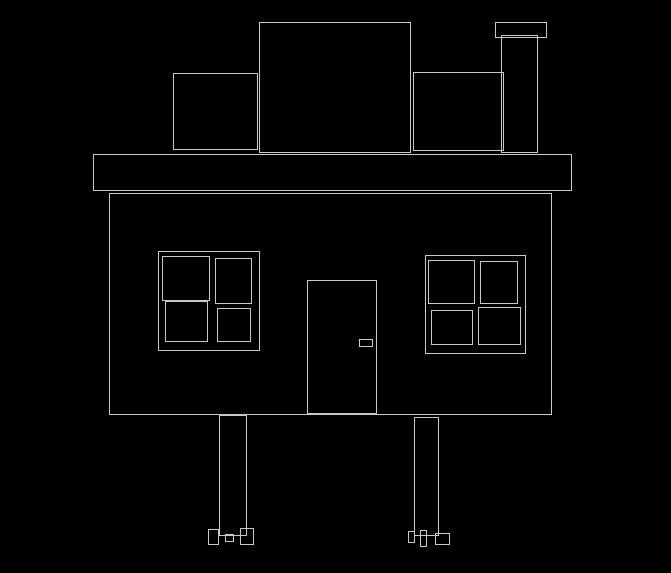

# Урок 2 - Графические примитивы
Приветствую на канале мяу код!

Сегодня мы рассмотрим рисование простых фигур с помощью модуля pygame draw.

## Инфо
Давайте вместо сухого разбора функций, разделим видео на две части. В первой быстро рассмотрим как отображать геометрические примитивы, а во второй -  напишем несколько приложений с полученными знаниями.

Напомню, что все уроки вы можете найти на гитхабе, а также в виде статей в группе в вк.


# Теория

Из прошлого урока мы знаем, что фигуры рисуются в третьем сегменте игрового цикла, потому-что зачастую в ходе игры их позиция меняется и нам необходимо каждый кадр отображать данные изменения на экране. 

Следовательно первым параметром, который мы будем передавать в функции рисования, будет наш экземпляр окна. А вторым - цвет объекта в формате RGB.
```python
screen = pygame.display.set_mode((1000, 600))
WHITE = (200,200,200)
```

## Отрезок
Начнём с самой простой фигуры. Ею будет обычный отрезок!
Нам необходимо просто передать два списка, содержащие координаты его концов. Последним параметром задаём толщину отрезка.
```python
pygame.draw.line(screen, WHITE,  [10, 30], [290, 30])
pygame.draw.line(screen, WHITE, [10, 50], [290, 50], 1)
pygame.draw.line(screen, WHITE, [10, 70], [290, 70], 5)
pygame.draw.line(screen, WHITE, [10, 90], [290, 90], 20)
```


## Ломанная линия
Далее рассмотрим ломанные линии. Фактически, это те же отрезки, только мы можем задавать любое количество точек. Третьим параметром передаём флаг, отвечающий за необходимость замыкать крайние точки. Последним параметром также задаём толщину отрезка.
```python
pygame.draw.lines(screen, WHITE, True, [[20, 120], [120, 20], [220, 120]])
pygame.draw.lines(screen, WHITE, False, [[300, 120], [400, 20], [500, 120]], 3)
```


## Полигон
И сразу же рассмотрим полигон. Это та же ломанная линия, только заливающая всё внутреннее пространство цветом и всегда замкнутая.
```python
pygame.draw.polygon(screen, WHITE, [[20, 120], [120, 20],[220, 120]])
```


## Прямоугольник
Давайте теперь нарисуем прямоугольник! Передадим третьим параметром кортеж из четырёх значений. Первые два — позиция левого верхнего угла, а вторые — его ширина и высота. Также как и с линией мы можем передать последним параметром значение толщины. В случае, если параметр не передан, то прямоугольник будет закрашен.
```python
pygame.draw.rect(screen, WHITE, (20, 20, 100, 80))
pygame.draw.rect(screen, WHITE, (20, 120, 200, 40), 1)
pygame.draw.rect(screen, WHITE, (20, 190, 60, 100), 5)
```


## Круг
Пришло время нарисовать круг) Передаём кортеж со значением его центра, затем передаём радиус. Последним значением передаём толщину, чтобы получить окружность!
```python
pygame.draw.circle(screen, WHITE, (100, 100), 40)
pygame.draw.circle(screen, WHITE, (210, 100), 45, 2)
pygame.draw.circle(screen, WHITE, (300, 100), 30, 9)
```


## Эллипс
Теперь нарисуем эллипс. Тут всё очень просто — передаём значения как для прямоугольника. В него и будет вписан наш эллипс.
```python
pygame.draw.ellipse(screen, WHITE, (20, 40, 250, 100), 3)
pygame.draw.ellipse(screen, WHITE, (20, 170, 200, 60))
```


## Дуга
Ну и напоследок дуга. Указываем прямоугольник, а также начало и конец дуги в радианах. 
```python
pygame.draw.arc(screen, WHITE, (30, 40, 200, 70), 0, math.pi)
pygame.draw.arc(screen, WHITE, (250, 10, 200, 80), math.pi, 2*math.pi, 3)
pygame.draw.arc(screen, WHITE, (30, 100, 170, 60), 0.3*math.pi, 1.75*math.pi, 5)
```


На этом описание геометрических примитивов думаю можно заканчивать. Давайте перейдём к практике !


# Практика
События мыши и клавиатуры мы разберём в следующем кратком уроке. 

## Созвездие
Первую программу назовём созвездие)
Зададим чёрный и белый цвета. А также список, в котором у нас будут храниться списки координат точек для построения ломанной линии.
```python
BLACK = (0,0,0)
WHITE = (200,200,200)
stars = []
```

Нарисуем звёзды! Пройдёмся по списку и вокруг каждой точки опишем окружность радиусом 3. 
```python
for dot in stars:
    pygame.draw.circle(screen, WHITE, dot, 3)
```

Далее, если количество звёзд в созвездии больше двух — рисуем ломанную линию между ними)
```python
if (len(stars) >= 2):
    pygame.draw.lines(screen, WHITE, False, stars)
```

А теперь напишем событие, которое позволит создавать звёзды! Использую тип события — нажатие мыши, проверяю, что нажата левая кнопка и добавляю в созвездие список, хранящий позицию нажатия.
```python
if event.type == pygame.MOUSEBUTTONDOWN:
    if event.button == 1:
        stars.append(list(event.pos))
```

Давайте посмотрим! 




Можно добавить анимацию звезды и возможность разрывания линий. Например вот так) 




Пишите в комментарии, как вы дополните свои программы, чтобы получить подобный результат)

## Прямоугольники
А теперь напишем программу чуточку посложнее.
Зададим цвета, список прямоугольников, счётчик и флаг нажатия.
```python
BLACK = (0,0,0)
WHITE = (200,200,200)
sq_array = [[]]
count = 0
press = False
```

Будем проходить по списку и, если длина списка равна двум, то есть он содержит точку начала и рамеры, будем рисовать прямоугольник с этими параметрами.
```python
for params in sq_array:
    if len(params) == 2:
        pygame.draw.rect(screen, WHITE, (params), 1)
```

В событиях напишем следующее. 
При нажатии левой кнопки мыши мы устанавливаем флаг нажатия и добавляем в нужный нам список параметры позиции нажатия и нулевую размерность прямоугольника.
```python
if event.type == pygame.MOUSEBUTTONDOWN:
    if event.button == 1:
        press = True
        sq_array[count] = [event.pos, [0, 0]]
```

При отпускании левой кнопки — убираем флаг нажатия, добавляем пустой список для следующего прямоугольника и увеличиваем их счётчик на единицу.
```python
if event.type == pygame.MOUSEBUTTONUP:
    if event.button == 1:
        press = False
        sq_array.append([])
        count+=1
```

Далее, во время движения мышью, если нажата левая кнопка — каждый кадр используем небольшое лямбда выражение для расчёта ширины и высоты прямоугольника. 
```python
if event.type == pygame.MOUSEMOTION:
    if press:
        sq_array[count][1] = list(
            map(lambda x, y: x - y, event.pos, sq_array[count][0]))
```

Вот что получилось!) С помощью подобного простого скрипта мы получили власть над рисованием прямоугольников




# Итог
На этом данное видео подходит к концу. Сегодня мы познакомились с рисованием и немного взглянули на события мыши. 

Спасибо за просмотр и вашу поддержу!
Подписывайтесь на канал, чтобы не пропустить следующие выпуски) Ведь мы всё ближе подходим к написанию своей собственной игры

До новых встреч!

